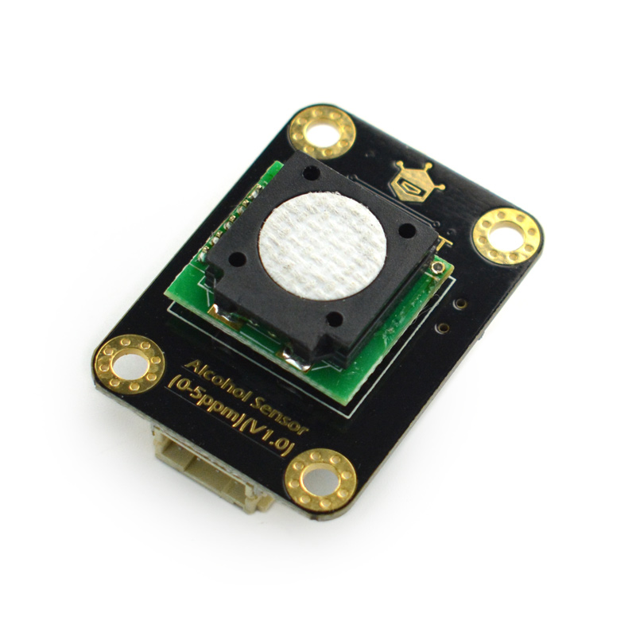

# DFRobot_Alcohol
- [中文版](./README_CN.md)

This is an Arduino-compatible alcohol concentration sensor module, with a measurement range of 0-5ppm, and supports both I2C and UART output methods. After factory calibration, it can quickly and accurately measure the concentration of alcohol vapor in the environment. It is suitable for alcohol vapor concentration detection in drunk driving detection, automobile intelligence and other low-concentration scenarios. 



## Product Link（https://www.dfrobot.com/product-2186.html）

    SKU：SEN0376

## Table of Contents

* [Summary](#Summary)
* [Installation](#Installation)
* [Methods](#Methods)
* [Compatibility](#Compatibility)
* [History](#History)
* [Credits](#Credits)

## Summary

Using the electrochemical principle, it has been calibrated before leaving the factory, which can accurately measure the alcohol concentration in the environment. And it has the characteristics of strong anti-interference ability, high stability and high sensitivity, and has a service life of up to two years. Resolution can reach 0.01ppm (10ppb), support 3.3~5.5V wide voltage input, with two data output types: I2C and UART。

## Installation
Download the library file before use, paste it into the custom directory for Raspberry Pi, then open the examples folder and run the demo in the folder.

## Methods

```python
  '''!
    @brief set the mode
    @param MEASURE_MODE_AUTOMATIC  active mode
    @param MEASURE_MODE_PASSIVE    passive mode
  '''
  def set_mode(self, mode):

  '''!
    @brief get the alcohol data, units of PPM
    @param collectnum Collect the number
    @return  alcohol concentration, (units PPM)
  '''
  def get_alcohol_data(self, collectnum):

```

## Compatibility

* RaspberryPi Version

| Board        | Work Well | Work Wrong | Untested | Remarks |
| ------------ | :-------: | :--------: | :------: | ------- |
| RaspberryPi2 |           |            |    √     |         |
| RaspberryPi3 |     √     |            |          |         |
| RaspberryPi4 |           |            |    √     |         |

* Python Version

| Python  | Work Well | Work Wrong | Untested | Remarks |
| ------- | :-------: | :--------: | :------: | ------- |
| Python2 |     √     |            |          |         |
| Python3 |     √     |            |          |         |


## History

- 2020/9/9 - V1.0.0 Version

## Credits

Written by ZhixinLiu(zhixin.liu@dfrobot.com), 2020. (Welcome to our [website](https://www.dfrobot.com/))
