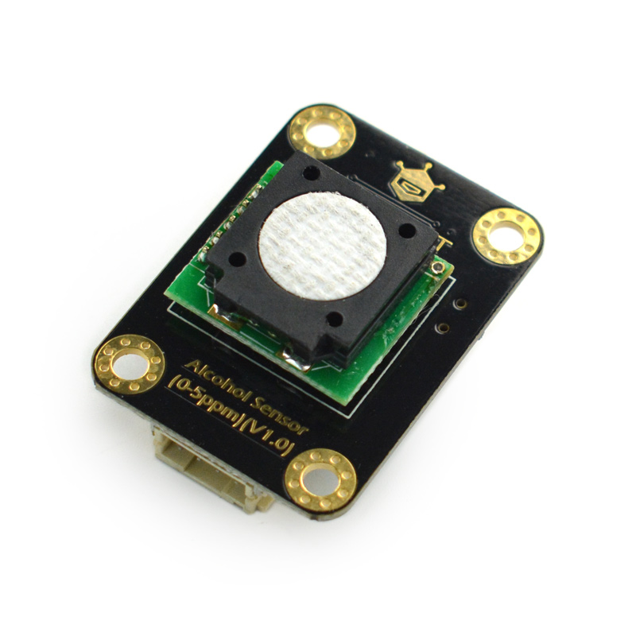

# DFRobot_Alcohol
- [English Version](./README.md)

这是一款Arduino兼容的酒精浓度传感器模组，测量范围0-5ppm，支持I2C和UART两种输出方式，经过出厂标定，可以快速、准确的测量环境中酒精蒸汽的浓度。适用于酒驾检测、汽车智能化及其他小浓度场景下的酒精蒸汽浓度检测。




## 产品链接（https://www.dfrobot.com.cn/goods-2995.html）

    SKU：SEN0376

## 目录

* [概述](#概述)
* [库安装](#库安装)
* [方法](#方法)
* [兼容性](#兼容性y)
* [历史](#历史)
* [创作者](#创作者)

## 概述

DFRobot推出的酒精传感器，采用电化学原理，出厂前已经进行过标定，可以准确测量环境中的酒精浓度。<br>并具有抗干扰能力强、稳定性高、灵敏度高等特点，使用寿命长达两年。分辨率可以达到0.01ppm(10ppb)，<br>支持3.3~5.5V宽电压输入，具有I2C和UART两种数据输出类型，兼容Arduino、ESP32、树莓派等主流的主控设备，具有良好的兼容性。简单易用的Gravity接口，配上我们的样例代码，可迅速搭建出自己的酒精浓度检测仪。

## 库安装
使用此库前，请首先下载库文件，将其粘贴到树莓派的自定义目录中，然后打开examples文件夹并在该文件夹中运行演示。

## 方法

```python
  '''!
    @brief 设置模式
    @param MEASURE_MODE_AUTOMATIC  主动测量模式
    @param MEASURE_MODE_PASSIVE    问答测量模式
  '''
  def set_mode(self, mode):

  '''!
    @brief 获取酒精浓度数据 单位 ppm
    @param collectnum 连续采集的个数
    @return  酒精浓度, (单位 ppm)
  '''
  def get_alcohol_data(self, collectnum):
```

## 兼容性

* RaspberryPi Version

| Board        | 正常运行  | 运行失败   | 未测试    | 备注
| ------------ | :-------: | :--------: | :------: | :-----: |
| RaspberryPi2 |           |            |    √     |         |
| RaspberryPi3 |           |            |    √     |         |
| RaspberryPi4 |     √     |            |          |         |

* Python版本

| Python  | 正常运行  | 运行失败   | 未测试    | 备注
| ------- | :-------: | :--------: | :------: | :-----: |
| Python2 |     √     |            |          |         |
| Python3 |     √     |            |          |         |


## 历史

- 2019/9/9 - V1.0.0 版本

## 创作者

Written by ZhixinLiu(zhixin.liu@dfrobot.com), 2020. (Welcome to our [website](https://www.dfrobot.com/))